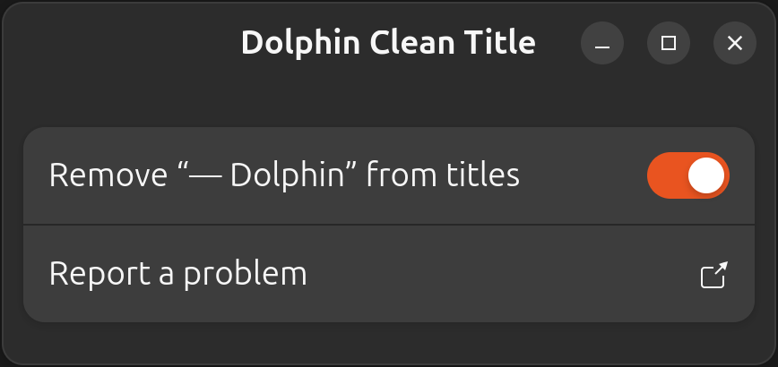

# dolphin-clean-title

[](LICENSE)
[](#compatibility)
[](#privacy-and-external-services)

A standalone Linux package that removes one trailing `— Dolphin` or `- Dolphin`
from Dolphin window titles without modifying Dolphin or depending on a specific
taskbar.



## Install

Download the latest `.deb` from [GitHub Releases](https://github.com/d0d1/dolphin-clean-title/releases) and install it:

```bash
sudo apt install ./dolphin-clean-title_0.1.0-1_all.deb
```

## Use

Open **Dolphin Clean Title** from the application launcher and enable the switch.

To disable the feature, turn the switch off or run:

```
dolphin-clean-title disable
```

## Compatibility

Verified on Ubuntu 24.04 LTS with GNOME Wayland and Dolphin 23.08.5. The package requires Python 3.10 or newer, an accessible X11 DISPLAY (Xorg or XWayland), and a working user systemd manager. On Wayland, managed Dolphin GUI windows use XWayland; title cleaning does not apply to native Wayland Dolphin windows. Sessions without XWayland are unsupported.

## Uninstall

```bash
dolphin-clean-title disable
sudo apt remove dolphin-clean-title
```

## Privacy and external services

Dolphin Clean Title runs entirely locally. It has no telemetry or analytics, makes no network requests, requires no account, payments, or subscriptions, and has no external runtime service dependencies.

## Docs

- [Architecture](docs/architecture.md)
- [Development and packaging](docs/development.md)
- [Tooling](docs/tooling.md)
- [Testing](docs/testing.md)
- [Debugging](docs/debugging.md)
- [Contributing](CONTRIBUTING.md)
- [Agent instructions](AGENTS.md)
